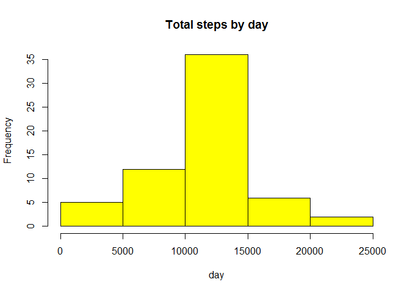

# Reproducible Research: Peer Assessment 1
## I am going to be using library(lattice)

```r
    library(lattice)
```
## Loading and preprocessing the data

```r
    step_data<-read.csv("activity.csv", colClasses = c("numeric","character","numeric"))
    step_data$date<-as.Date(step_data$date,"%Y-%m-%d")
```

## What is mean total number of steps taken per day?
## Presenting histogram with mean total number of steps


```r
    Steps_tot<-aggregate(steps ~ date, data = step_data, sum, na.rm = TRUE)
    H<-hist(Steps_tot$steps,main="Total steps by day",xlab ="day",col="blue")
```

 

```r
    mean(Steps_tot$steps)
```

```
## [1] 10766.19
```

```r
    median(Steps_tot$steps)
```

```
## [1] 10765
```
## What is the average daily activity pattern?


```r
t_serie<-tapply(step_data$steps,step_data$interval,mean,na.rm=TRUE)

    plot(row.names(t_serie),t_serie,type="l",xlab="5-min interval", 
            ylab="Average across all Days",main="Average number of steps taken", 
            col="green")
```

 

```r
    max_int<-which.max(t_serie)
    names(max_int)
```

```
## [1] "835"
```
## Imputing missing values


```r
    step_data_NA <- sum(is.na(step_data))
    step_data_NA
```

```
## [1] 2304
```

```r
    Steps_avg<-aggregate(steps~interval,data=step_data,FUN=mean)
    filling<-numeric()
    for (i in 1:nrow(step_data)) {
      obs<-step_data[i, ]
        if (is.na(obs$steps)) {
          steps<-subset(Steps_avg,interval==obs$interval)$steps
      } else {
    steps <- obs$steps
              }
    filling <- c(filling, steps)
    }

    step_data_new<-step_data
    step_data_new$steps<-filling
    Steps_tot2<-aggregate(steps~date,data=step_data_new,sum,na.rm=TRUE)

    hist(Steps_tot2$steps, main = "Total steps by day", xlab = "day", col = "yellow")
```

 

```r
    mean(Steps_tot2$steps)
```

```
## [1] 10766.19
```

```r
    median(Steps_tot2$steps)
```

```
## [1] 10766.19
```

## Are there differences in activity patterns between weekdays and weekends?


```r
    day <- weekdays(step_data$date)
    day_l <- vector()
    for (i in 1:nrow(step_data)) {
      if (day[i]=="Saturday"|day[i]=="Sunday") 
        day_l[i]<-"Weekend"
     
      else {
        day_l[i]<-"Weekday"
            }
    }
    step_data$day_l<-day_l
    step_data$day_l<-factor(step_data$day_l)

    steps_day<-aggregate(steps~interval+day_l,data=step_data,mean)
    names(steps_day)<-c("interval","day_l","steps")

    xyplot(steps~interval|day_l,steps_day,type="l",layout=c(1,2),xlab="Interval",
       ylab="Number of steps")
```

 
